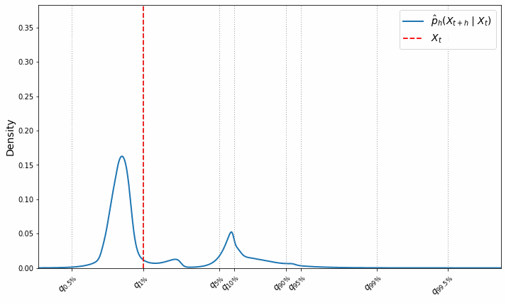

I am a first-year PhD student in mathematics, working under the supervision of Fabrice Rossi and Arthur Thomas.
I am currently working on combining machine learning with noncausal econometric methods to forecast locally explosive time series.

**Breaking news!!**

If you think this gif is as cool as I do, you might enjoy our <a href="https://arxiv.org/abs/2601.14049">working paper</a> with Elena Dumitrescu and Arthur Thomas.

Also desperately waiting for Olympique Lyonnais to lift a title, for Pierre Sage to make a comeback, and for Cherki to win the Ballon d’Or.

